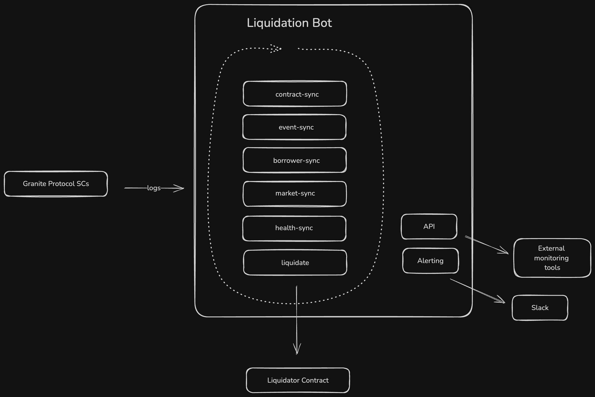

# Liquidation Bot (DEX)

## Introduction

The liquidation bot is responsible for liquidating user positions that are at risk.

It consists of multiple workers that operate together to build, calculate, and execute liquidation transactions.  
The bot also includes an API to expose internal data, and an alerting system to notify external systems or developers of key events.



### 🛠️ Workers

#### 🔁 Worker Cycle

Every 7 seconds, the system executes all 6 workers described below sequentially in a fixed loop.  
Each worker performs its task (fetch, calculate, update, or act) and hands off control to the next one.

This repeating execution pattern is referred to as the **Worker Cycle**.

*There’s no magic in choosing 7 seconds — it’s simply enough time to run all tasks and include a small delay.  
If the workers take longer than 7 seconds, the next cycle starts immediately without delay.*


### ⚙️ contract-sync worker

Responsible for contract lock/unlock handling, liquidation record finalization, check sync activation, and balance updates.

If there is an ongoing liquidation transaction:

- Checks the transaction's status. If the status is not `pending` (i.e., the transaction is finalized), it schedules an unlock to be executed in 1 minute.
- Marks the corresponding liquidation record with the transaction's status code.
- Activates sync checks for affected users.
- Triggers the `onLiqTxEnd` alert.
- Finalizes any previously scheduled unlock, if applicable.

Then updates balances:

- Operator's STX balance  
- Liquidator contract's market asset balance  
- Liquidator contract's collateral asset balance


### ⚙️ event-sync worker

Scans the Granite protocol smart contracts to extract borrower wallet addresses and inserts them into the `borrower` table.

**Followed contracts:**
- `borrower`
- `state`
- `liquidator`

**Tracked contract log types:**
- `borrow`
- `add-collateral`
- `remove-collateral`
- `deposit`
- `withdraw`
- `liquidate-collateral`
- `repay`


### ⚙️ borrower-sync worker

Responsible for fetching and building the borrower state by:

- Updating position data into the `borrower_position` table  
- Updating collateral data into the `borrower_collaterals` table  

This process runs **only** for users with check sync activated.


#### Check Sync

Check sync is a flag-based mechanism that marks specific users (borrowers) for a full borrower state refresh.

When a user is marked for check sync:

- The `borrower-sync` worker fetches their latest position and collateral data from the chain.
- The `health-sync` worker recalculates their health metrics (ltv, risk, max repay, etc.).

This mechanism ensures that users affected by a recent liquidation attempt or on-chain event are re-synced before the next liquidation decision is made.


### ⚙️ market-sync worker

Collects, builds, and caches the necessary market state variables required to calculate liquidations.

Collected data is stored in the `kv_store` table to be shared with other workers/processes.

Data is fetched from the following smart contract methods:
- `ir.get-ir-params`
- `state.get-lp-params`
- `state.get-accrue-interest-params`
- `state.get-debt-params`
- `state.get-collateral`


### ⚙️ health-sync worker

Responsible for building up-to-date borrower health data using:

- Data collected by the workers listed above  
- Pyth price feed  

The calculated data is stored in the `borrower_status` table to be shared with other workers/processes in the following format:

```json
{
    "address": "SP1RG3YP9C8SC82GVHT1E1WG22MYHTCJ4FT3T9R4G",
    "ltv": 0.3054,
    "health": 1.4734,
    "debt": 10.2774,
    "collateral": 33.6504,
    "risk": 0.6787,
    "maxRepay": {
        "SM3VDXK3WZZSA84XXFKAFAF15NNZX32CTSG82JFQ4.sbtc-token": 200
    },
    "totalRepayAmount": 0
}
```

### ⚙️ liquidate worker

Reads borrower health data from the `borrower_status` table and triggers liquidation transactions if there are any applicable user positions.

#### 🧮 Liquidation Batch

- Batches are sorted by `total_repay_amount DESC` to prioritize the largest liquidable positions.
- The batch size is limited by the contract’s market asset balance.
- If the balance is insufficient to cover all liquidations, the last item in the batch (or the only one) will be a **partial liquidation**.

#### 🔹 Minimum to Liquidate per user

- Borrowers with a liquidation amount below `MIN_TO_LIQUIDATE_PER_USER` (defined in constants) are excluded from the batch.

#### 🔹 Minimum to Liquidate

- If the **sum** of the liquidation batch is below `MIN_TO_LIQUIDATE` (defined in constants), the bot skips the liquidation.

#### 💰 Minimum Expected Market Asset Amount Check

- The bot calculates the *minimum expected* amount of market asset to be **received** at the end of the operation, based on the contract's `unprofitability-threshold` variable.
- This expected amount is then compared with the current output from the DEX.
- If the DEX output is below the expected threshold, the worker **skips** the liquidation.
- If the `SKIP_SWAP_CHECK` environment variable is set to `1`, this check is bypassed.
- The `onLiqSwapOutError` alert is triggered when the check fails.

ℹ️ The check is based on the integrated DEX's current prices. It may fail once or twice and succeed on a subsequent attempt.

#### 🧪 Dry Run Mode

- When the `DRY_RUN` environment variable is set to `1`, the bot will **not broadcast** liquidation transactions.

#### ⛔ Execution Skipped If

The worker skips liquidation in the following cases:

- No liquidator contract is set  
- Liquidator contract is **locked** (i.e., a liquidation transaction is in progress)  
- A borrower is pending sync (`borrower-sync` worker)  
- No liquidable positions available  
- The liquidation contract has **no market asset balance**  
- The liquidation amount is smaller than `MIN_TO_LIQUIDATE`  
- The minimum expected market asset amount check fails  
- Dry run mode is activated

#### ✅ If All Checks Pass

- The bot broadcasts the liquidation transaction to the blockchain.

#### 🪙 Fee estimation
Uses an optimistically determined transaction fee depending on the blockchain's mempool size.

#### 🔢 Nonce determination
Uses the Hiro API:  `/extended/v1/address/${principal}/nonces → possible_next_nonce`

#### ❌ If Transaction Broadcasting Fails

*The most likely reason is insufficient operator balance in the liquidator contract.*

- The `onLiqTxError` alert is triggered with the on-chain rejection message.

#### ✅ If Transaction Broadcasting Succeeds

- Locks the liquidator contract. 
- Inserts a liquidation record into the `liquidation` table.
- Triggers the `onLiqTx` alert.

ℹ️ Regardless of success, failure, or skip, the bot continues operating in the next **Worker Cycle**.


#### 🔓 Liquidator Contract Lock & Unlock

The liquidator contract uses a lock to prevent multiple liquidation transactions from being processed at the same time.

- When a liquidation transaction is broadcast, the contract is locked.
- The lock prevents any new liquidation attempts until the current one is finalized.

- The `contract-sync` worker checks the transaction status.
  - If the transaction is finalized (not `pending`), it schedules an unlock after 1 minute.

This ensures only one liquidation is processed at a time and prevents race conditions.

-------------

### API

The API provides access to data stored in the liquidation bot's database.  
A more comprehensive API documentation can be found [here](/src/api/API.md).

ℹ️ Currently, only one contract can be added to the system.

**Endpoints:**

- `/contracts`  
  Returns a list of liquidator contracts integrated into the system.

- `/add-contract`  
  Adds a new liquidator contract to the system.

- `/borrowers`  
  Returns a list of borrowers, sorted by `total_repay_amount DESC, risk DESC`.

- `/health`  
  Returns basic **monitoring and observability** info such as operator balance, last sync time, and last liquidation.

- `/liquidations`  
  Returns a list of previously executed liquidations.

- `/config`  
  Returns all configuration values currently used by the bot.

-------------

### Alert System

The following hooks trigger alerts. Currently, only Slack is supported as the alerting channel.

- `onStart`  
  Triggered when the bot starts.

- `onExit(msg?: string)`  
  Triggered when the bot stops. An optional message can be included, especially in case of unexpected failures.

- `onLiqTx(txid: string, spend: number, receive: number, minExpected: number, dex: string, collateralPrice: string, batch: LiquidationBatch[])`  
  Triggered when a liquidation transaction is broadcast.

- `onLiqSwapOutError(spend: number, receive: number, minExpected: number, dex: string, dy: number)`  
  Triggered when the minimum expected market asset amount check fails.

- `onLiqTxError(reason: string)`  
  Triggered when the bot fails to broadcast a transaction.

- `onLiqTxEnd(txid: string, status: string)`  
  Triggered when a transaction is finalized.

- `onLowFunds(balance: string, address: string)` 
  Triggered when the operator STX balance is low. 

-------------

## Future Considerations

- The bot can be extended to support multiple liquidator contracts, each dedicated to a different liquidation method — e.g., one for DEX-based liquidations.


## Hosting and stack

- Bunjs
- Sqlite
- Amazon ECS
